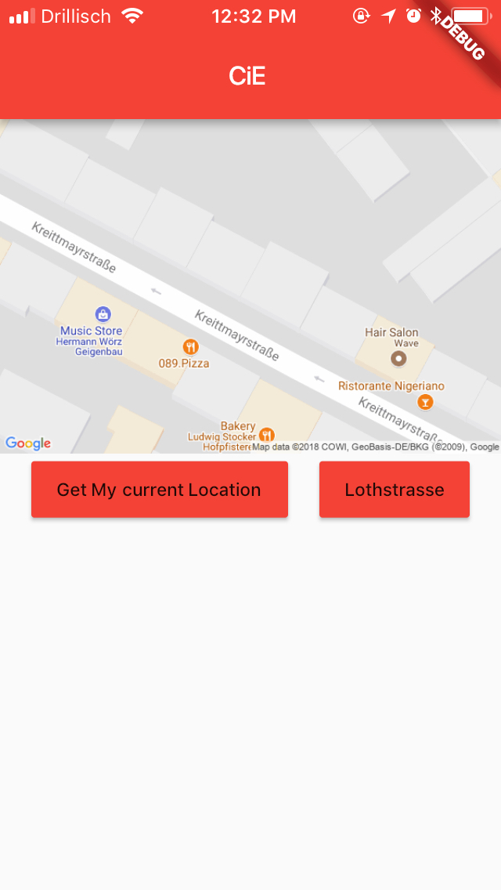

# cie_team1

dev-team-1-cie-app-in-flutter 

# Map
This is a very basic implementation of the Map feature of out CiE App,
At the moment it's static.

### Dependencies:
`location: "^1.2.0"`  
`url_launcher: "^3.0.1"`  

### Other adjustments
* In ios/Runner: Addition to `info.plist` file:
    ```xml
    <key>NSLocationWhenInUseUsageDescription</key>
    <string>The app would like to use your location</string>
    <array>
    	<string>googlechromes</string>
    	<string>comgooglemaps</string>
	</array>
    ```

* In android/src/main: Addition to `AndroidManifest.xml` file:
    ```xml
    <uses-permission android:name="android.permission.ACCESS_FINE_LOCATION"/>
    ```

### What it does:
* Show a map of the three Hochschule Muenchen campuses
* Show your current location in the map by actually getting your device location (not anymore a.t.m.). 

### Next steps:
* Make it full screen or at least nicer => almost done, buttons still off
* Put a pin on the map
* (If possible) put a link in the map to open the native Google Maps App => possible, not working yet

### Screenshots of Version 0.2


### Screenshots of Version 0.1
#### Current location  



#### HM Lothstrasse location


The tutorial I used to code this can be found [here](https://ericwindmill.com/zero-to-one-with-flutter-google-maps-app-pt-1/)
